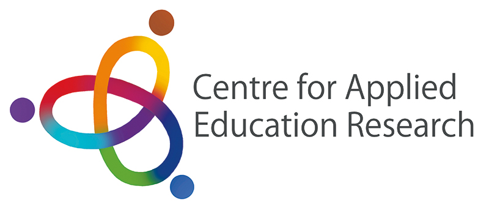
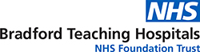
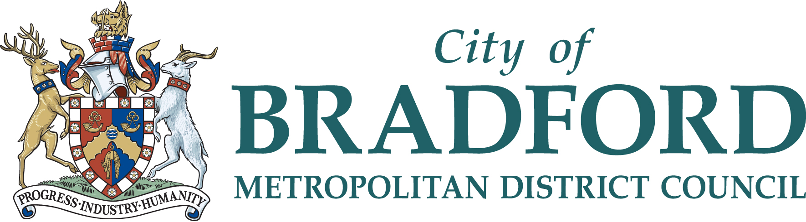
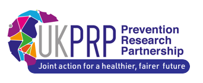
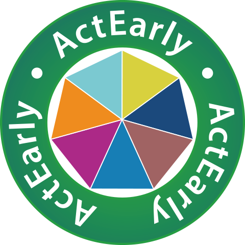

The ActEarly: Holme Wood programme brings data scientists, community members, practitioners, and service providers together to explore how lives can be improved through data science. The programme consists of:

-   Analysis and modelling of routine and newly generated/linked data relevant to priority issues within the community to identify where there are patterns, relationships, and predictive indicators for issues

-   Gathering input from the community to gain a richer understanding of identified issues and the local context

-   Creation of interactive, publicly accessible data visualisations, which policymakers, community members, and service providers can utilise to test different predictions and develop new ideas to resolve identified issues, thereby informing decision-making on policies and interventions

-   This project is contributed by:

{#id .class width="22%" height="22%"} {.class width="18%" height="18%"} {.class width="14%" height="14%"} {.class width="25%" height="30%"}

{.class width="25%" height="30%"}
{.class width="15%" height="30%"} {.class width="25%" height="30%"} 
{.class width="20%" height="30%"} 

{.class width="10%" height="10%"}

