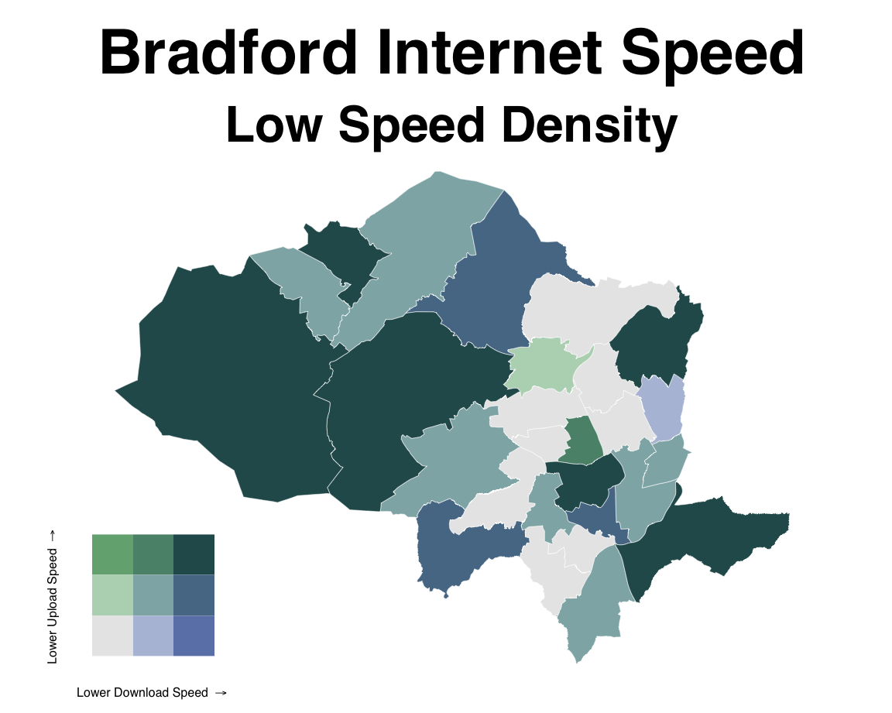
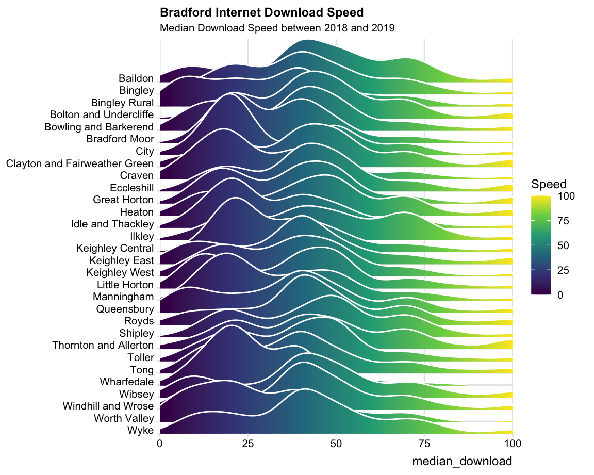

## Background: 

- Broadband: New survey shows the fastest and slowest parts of the Bradford district [Telegraph & Argus, 5th June 2020](https://www.thetelegraphandargus.co.uk/news/18499874.broadband-new-survey-shows-fastest-slowest-parts-bradford-district/).

- Schools, trusts and local authorities can help disadvantaged children get online using free mobile data increases or 4G wireless routers provided by the Department for Education. [Gov.uk link](https://get-help-with-tech.education.gov.uk/internet-access)

{#id .class width="100%" height="100%"}  

{#id .class width="100%" height="100%"}  

{#id .class width="100%" height="100%"}  

