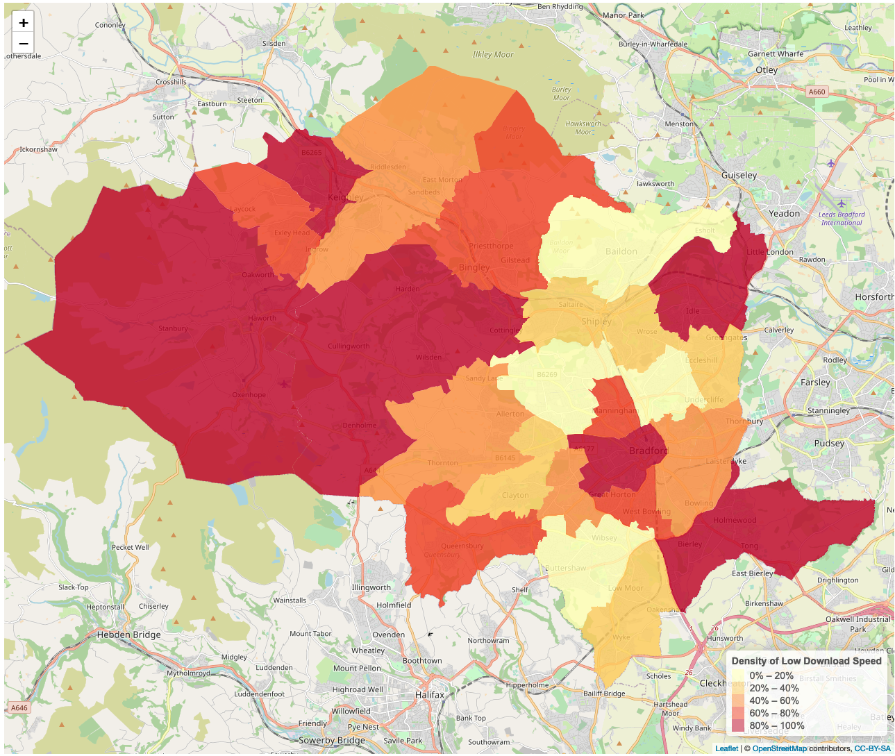

Current situation: 

Broadband: New survey shows the fastest and slowest parts of the Bradford district (Telegraph & Argus, 5th June 2020). link

Schools, trusts and local authorities can help disadvantaged children get online using free mobile data increases or 4G wireless routers provided by the Department for Education. link

{#id .class width="100%" height="100%"}  

{#id .class width="100%" height="100%"}  

{#id .class width="100%" height="100%"}  

