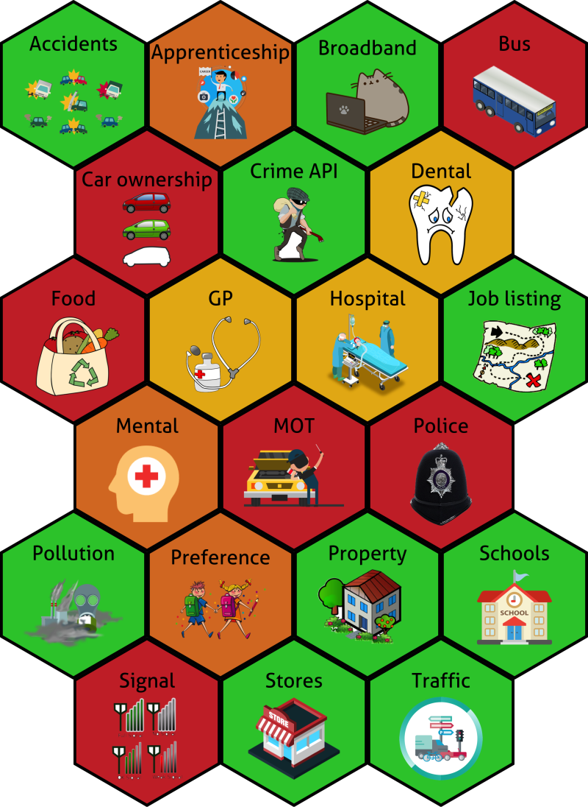

To finish the data puzzle.

{#id .class width="100%" height="100%"}

-   Green - Accessible; Open data

-   Yellow - Accessible; Protected data (BIHR)

-   Brown - Accessible; Protected data (Data partners)

-   Red - Not accessible; Protected data (Data partners)
