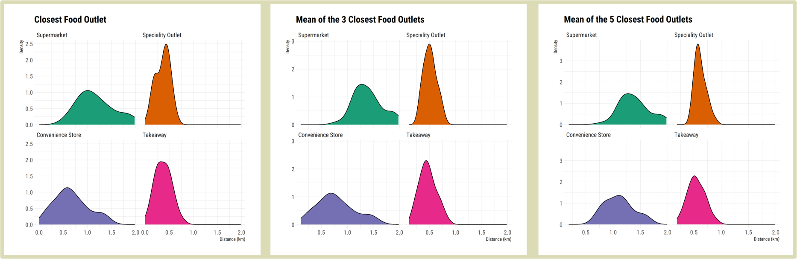

```{r setup, include=FALSE}
knitr::opts_chunk$set(echo = FALSE)
```


## Setting the Context {.tabset .tabset-dropdown}

This project developed a ‘proof of concept’ community toolkit to visualise food environment accessibility for a deprived community in Bradford, empowering local policymakers and residents to collaborate through evidence-based decision making.

### Project overview


Obesity and other non-communicable diseases linked to sedentary lifestyles and poor diet are on the rise globally.  Modern food environments play an important role in this and have evolved to promote choices that adversely impact people’s physical and mental health.  These are described as being more obesogenic (obesity promoting) due to the relative ease in which unhealthy foods can be acquired, lacking essential nutrients and containing more energy than is necessary.  The concept of food environments covers a wide range of physical, economic, socio-cultural and policy factors, one of which is the accessibility and affordability of retail food outlets.  Communities experiencing high levels of deprivation are disproportionately impacted, facing barriers to mobility and an overwhelming choice of unhealthy and expensive food creating the perfect conditions for obesogenic food environments.

Holme Wood is one such community in Bradford and the focus of the ActEarly project.  At a workshop last year, residents reported that their options for purchasing healthy, affordable food were limited.  This project has mapped the local food environment and generated granular accessibility measures for small groups of households within the study area.  These have been integrated into an interactive community toolkit for local stakeholders to collaborate in regeneration and intervention policies that are targeted at improving access to their food environment.  This project is unique in that it generates accessibility measures at a more granular scale than existing research and combines it with open data in a ‘proof of concept’ interactive visualisation tool.

The toolkit can be accessed using the following URL: 

### Data and methods


We created food outlet accessibility measures for Holme Wood using Ordnance Survey Points of Interest (POI) data and postcode units.  These data were chosen due to their detailed level of spatial granularity, which can often be a barrier when conducting localised spatial analysis.

POI data were cleaned and categorised using the same groups as the Food Environment Assessment Tool (FEAT) for consistency.  The following groups were chosen to be part of the analysis:

1. Supermarkets: Major national supermarket chain stores (including small-format brands such as Sainsbury’s Local and Tesco Express/Metro)

2. Speciality Outlets: A wide range of outlets specialising in a narrow type of food produce, including (but not limited to) Butchers, Frozen Foods, Grocers, Markets and Baking/Confectionery.

3. Convenience Stores: Local convenience stores that can vary in types of food stocked but typically characterised by longer opening hours and food and drink from a broader range of categories than speciality outlets.

4. Takeaways: Fast food and takeaways outlets, delivery services, fish and chip shops and bakeries.

Access measures were drawn from a range of existing research and calculated using postcode units within the Holme Wood study area as an origin.  As the area is urban, Euclidean (straight-line) distance calculations were used to establish travel boundaries.  The following measures were used to determine accessibility to the food environment for each outlet type:

- Distance to the closest food outlet

- Mean distance to the closest 3 food outlets

- Mean distance to the closest 5 food outlets

- Count of outlets within 500m/1km/1.6km/2km

These measures were used to create a series of outputs at the postcode unit level.  A neighbourhood level analysis was conducted looking at distribution of distance measures across all postcode units.  Individual postcode unit measures were visualised within the community toolkit application.

The community toolkit was built in R Shiny and deployed on ShinyApps.IO.  It can be found at the following link: https://tbalbone31.shinyapps.io/lida1healthychoices/

The project repository can be accessed at: https://github.com/tbalbone31/LIDA1healthychoices

### Key findings


The neighbourhood level analysis is shown in the density plots below.


```{r probabilitydistributions, echo=FALSE}

```

Each measure shows a similar trend, that supermarkets are more likely to be the least accessible outlet type for a large proportion of the area.  On the other hand, Takeaways are much more likely to be within a relatively small distance across most of the neighbourhood.  This intensifies when considering the mean of closest 3 and 5 outlets, where more choices within each group are being considered.  There appears to be better access to Convenience Stores and Speciality Outlets, however the variety of food available and affordability at these outlet types can vary significantly (Black et al, 2014).   Whilst there appears to be access to supermarkets and some other outlet types, this is varied across the area and overwhelmed by the density of takeaways right on resident’s doorsteps.

People who experience higher relative deprivation often face barriers to mobility, the consequences of which are that people in Holme Wood are likely to be more reliant on their immediate food environment than those who are less deprived.  Further research is necessary into what choices are available in local outlets and whether this can be improved through work with community groups and policymakers.

Providing an interactive community toolkit that shows a more granular level of data visualisation is an important step towards empowering these groups to further understand the challenges communities face by including residents and other stakeholders in the decision-making process.  To place the postcode measures in context, a range of existing datasets related to the local environment have been included.  This toolkit also acts to signpost users to linked research.

Some screenshots showing key features of the toolkit are shown below:


#### Application Home with Postcode Search

The application loads with a map of Holme Wood with all the postcode units contained within the study area MSOA.  The postcode search functionality is displayed on the left.

```{r appscreenshot1, echo=FALSE}
knitr::include_graphics("Appscreenshot1.png")
```


#### Postcode Search results (demonstrating clicking on a map unit)

Postcodes can be selected from either the input box or by clicking on a map point.  The result is a dynamic chart loaded underneath the search input.

```{r appscreenshot2, echo=FALSE}
knitr::include_graphics("Appscreenshot2.png")
```


#### Data Overlay

Some external data sources have been loaded into the application and can be visualised on the map by selecting the overlay from the input box in the top left.

```{r appscreenshot3, echo=FALSE}
knitr::include_graphics("Appscreenshot3.png")
```

### Challenges


There were several challenges that happened during the project.  One of the first was that an initial aim, to undertake modelling for optimal locations for new food outlets, was quickly discounted due to the small spatial scale of the study area.  This type of modelling often generates value by assessing where the demand for a service is required, in this case affordable, fresh food.  However in this case the distribution of indicators across the neighbourhood was not spatially varied enough to suggest that any one location would be better than the other.  Furthermore, it was difficult to gauge optimal location sites without visiting the study area, something which was not possible due to government restrictions.
Because of this, the focus of the project shifted to creating the interactive toolkit that was aimed at stimulating discussions about the local food environment with the community and policymakers.  It is recognition that although our analysis does demonstrate that access to healthier and more affordable food is poor, the solution may not be as simple as building a supermarket closer to the neighbourhood.

Most of the data used in the project was open and free from restrictions, however the Points of Interest dataset accessed from Ordnance Survey was limited.  The licence allows for use of the data for research, which was undertaken to calculate the accessibility measures.  The toolkit was not designed to be deployed as a product nor was it intended to be delivered as such to any client, it is a proof of concept that demonstrates the type of platform that could help meet the aims of the ActEarly project.  The POI data has not been included in the toolkit nor can it be distributed in any form with the source code, something which could be addressed by using an open dataset in future such as Geolytix Retail Points.  The justification for not using these within the prototype was that the OS POI dataset was much more comprehensive, containing many more categories such as takeaways and speciality outlets.  For conducting analysis and demonstrating a proof of concept, it was much more robust and complete.

### Outputs, Next Steps and Recommendations


The value of this research is that it takes existing approaches to calculating indicators of food environment provision and accessibility and applies it on a more local scale, providing information and evidence to key stakeholders using interactive visualisation tools and techniques.  Whilst the output is a proof of concept and not necessarily a final solution, it can be used to start honest conversations between local policymakers and members of the communities that they serve and ensure everybody is working from the same information.  It addresses a key aim of the ActEarly scheme to empower local communities using data science and analytics and lays the foundation for further research.
This toolkit could be expanded on and developed to service other communities and allow for future updates to datasets should the need arise.

### Insights


- Holme Wood faces many of the same challenges accessing the retail food environment as other deprived communities.

- Food outlets that offer less variety in choice and affordability have been quantitatively shown to be a more convenient choice for residents.

- Whilst the food environment can be complex to understand, aspects can be visualised using tools that are accessible to key policymakers and stakeholders.

- Future studies could expand on the proof-of-concept toolkit by adding new functionality, improving accessibility measures or applying to different areas.