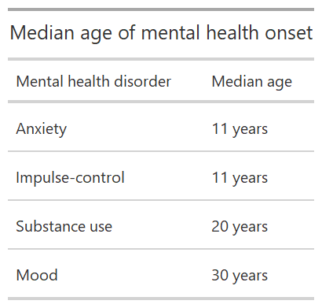
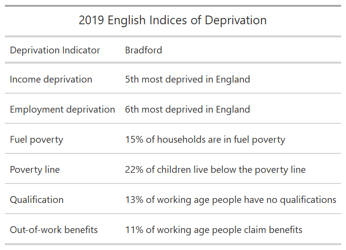
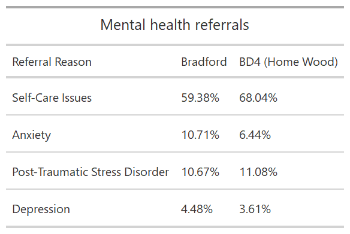
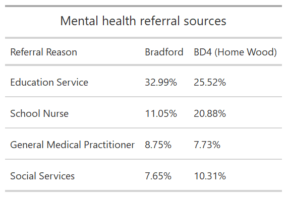

```{r setup, include=FALSE}
### load libraries
library(knitr)
```

# Background

## Mental ill health epidemic in Bradford

Mental health issues are prevalent within the Bradford District, with a mental ill health epidemic affecting children and young people (CYP). Mental health support has been identified as a top priority by community stakeholders in the Holme Wood area of the District. These stakeholders report a range of issues, including problems with accessibility to support, fragmented and poorly coordinated services, and insufficient resources. Stakeholders suggest the focus is on crisis management rather than early intervention. There is general recognition across the system that tackling these issues will result in better outcomes at the individual and community level, and could potentially offer savings in health, social care and policing costs. Thus, long-term solutions are needed in order to improve mental health support.


## Mental health

<p style="margin-left:10%; margin-right:10%;">

(...) mental health is more than just the absence of mental disorders or disabilities. Mental health is a state of well-being which an individual realizes his or her own abilities, can cope with the normal stresses of life, can work productively and is able to make a contribution to his or her community. Mental health is fundamental to our collective and individual ability as humans to think, emote, interact with each other, earn a living and enjoy life. [@world_health_organization_mental_2018]

<p>

Mental health disorders amongst children aged 5 to 16 in England have increased from one in nine (10.8%) in 2017 to one in six (16%) in 2020 [@nhs_digital_mental_2020]. The presence of mental health disorders is even higher among young people (17 to 22 years), with 27.2% of young women and 13.3% of young men having a probable mental disorder [@nhs_digital_mental_2020]. Most mental health conditions develop during childhood and youth (Table 1), with 50% of mental health conditions having started by age 14 years, rising to 75% by age 24 years [@kessler_lifetime_2005; @united_nations_policy_2020]. <br></br> <br>Table 1: A selection of mental health disorder onset <br>

```{r MentalHealthOnset, echo=FALSE, warning=FALSE, message=FALSE, fig.align="center"}

```

::: {style="text-align: center"}
Data source: @kessler_lifetime_2005
:::

<br></br>

<p style="margin-left:10%; margin-right:10%;">

"Children's mental health care has historically been a 'Cinderella service' within the NHS, with high numbers of children not accepted into treatment and long waits for those who can get on the waiting list." [@lennon_state_2021, p. 5]

</p>

In 2019 only 1 out of 4 children and young people estimated to need treatment accessed mental health support [@lennon_state_2021]. While the number of children and young people increased by 35% compared to 2018/19 (and nearly 60% compared to 2017/19), the number of children and young people receiving treatment has only risen by 4% [@lennon_state_2021]. <br>A range of socioeconomic, biological and environmental factors determine mental health risk [@world_health_organization_mental_2018]:

<ul>

<li>

socioeconomic pressures: in England, children with a probable mental disorder were more than twice as likely to come from a household fallen behind with payments (16.3%) than children unlikely to have a mental disorder [@nhs_digital_mental_2020]

</li>

<li>

[adverse childhood experiences](https://www.cdc.gov/violenceprevention/aces/fastfact.html?CDC_AA_refVal=https%3A%2F%2Fwww.cdc.gov%2Fviolenceprevention%2Facestudy%2Ffastfact.html%20“ACE%20definition”) (ACE) [@stevens_health_2019]

</li>

<li>

rapid social change

</li>

<li>

stressful work conditions

</li>

<li>

discrimination

</li>

<li>

social exclusion

</li>

<li>

unhealthy lifestyle

</li>

<li>

physical ill-health

</li>

<li>

(sexual) violence

</li>

</ul>

Though mental health support is one of the most neglected areas of health - on a global level, there is less than one mental health professional for every 10,000 people [@united_nations_policy_2020].


## Holme Wood in Bradford

Bradford, West Yorkshire's District with the highest population, has a larger proportion of children than England, Leeds, Sheffield, or Manchester [@city_of_bradford_metropolitan_district_council_bradford_2018]. Holme Wood is located in the south-east of Bradford in postcode district BD4 (Figure \@ref(fig:OverviewMap)). <br></br>

```{r OverviewMap,  width = 40, height = 30, fig.cap="Holme Wood in Bradford District", echo=FALSE, warning=FALSE , message=FALSE}

```

Children and young people, which account for nearly 30% of Bradford's population [@city_of_bradford_metropolitan_district_council_bradford_2018], are at risk of adverse childhood experiences due to high deprivation levels [@stevens_health_2019]. According to the [2019 English Indices of Deprivation](https://assets.publishing.service.gov.uk/government/uploads/system/uploads/attachment_data/file/833959/IoD2019_Infographic.pdf "Infographic"), Bradford ranks 13th most deprived of 317 local authorities (Table 2). 14 Bradford wards are amongst the 10% most deprived wards of England [@bradford_metropolitan_district_council_poverty_nodate]; Tong ward, where Holme Wood is located, being one of these. In 2015, 64% of the residents struggled to manage on their income [@booth_dying_2020]. The neighbourhood ([LSOA](https://datadictionary.nhs.uk/nhs_business_definitions/lower_layer_super_output_area.html "LSOA definition")) of Holme Wood was ranked 83 out of 32,844 LSOAs in England -- 1 being the most deprived [@ministry_of_housing_communities__local_government_indices_2019]. <br></br> <br>Table 2: Indices of Deprivation <br>

```{r Deprivation, echo=FALSE, warning=FALSE, message=FALSE, fig.align="center"}

```

::: {style="text-align: center"}
Data source: @bradford_metropolitan_district_council_poverty_nodate
:::

<br></br>


## COVID-19 pandemic


<p style="margin-left:10%; margin-right:10%;">

*What is COVID-19?* COVID-19 is a disease caused by a new coronavirus called SARS-CoV-2. WHO first learned of this new virus on 31 December 2019, following a report of a cluster of cases of 'viral pneumonia' in Wuhan, People's Republic of China. [@who_coronavirus_2020]

</p>

WHO has characterised COVID-19 as a [pandemic](https://www.who.int/emergencies/diseases/novel-coronavirus-2019/interactive-timeline/#event-71) on 11 March 2020, with Europe being the pandemic's epicentre on 13 March 2020. <br>On 16 March 2020, the [Prime Minister](https://www.gov.uk/government/speeches/pm-statement-on-coronavirus-16-march-2020%20“PM%20statement”) announced that people should work from home and avoid social venues to limit the spread of COVID-19. [Further restrictions](-%20https://www.instituteforgovernment.org.uk/sites/default/files/timeline-lockdown-web.pdf), including closing schools, have followed since, with the [first national lockdown coming into force on March 26](https://www.legislation.gov.uk/uksi/2020/350/introduction/made).


### The mental health impact of the COVID-19 pandemic

<p style="margin-left:10%; margin-right:10%;">

"The pandemic is also a mental health risk for our society." [@young_minds_coronavirus_2020]

</p>

Caused by the COVID-19 pandemic, a parallel pandemic of fear, anxiety, and depression has developed [@yao_patients_2020]. Various countries have recorded higher-than-usual levels of depression and anxiety [@united_nations_policy_2020]. These might be caused by widespread misinformation causing distress, media coverage of severely ill people, dead bodies, and coffins causing fear of losing loved ones without being able to say goodbye or hold funerals [@united_nations_policy_2020]. <br>Findings from recent research:

<ul>

<li>

@inkster_early_2021 have studied mental health-related Google Trends data and found that searches for "anxiety symptoms" have doubled between the beginning and end of March 2020.

</li>

<li>

@kwong_mental_2020 found that approximately twice as many young people in the UK experienced probable anxiety disorder and lower well-being during the pandemic than before. It is suggested that initially, as an effect of mitigation measures rather than the risk of a COVID-19 infection, anxiety and not depression has risen in children and young people [@kwong_mental_2020].

</li>

<li>

@pearcey_report_2020 have found that children and young people in the UK experienced increased emotional, behavioural, and restless difficulties during the first lockdown.

</li>

<li>

[Young Minds](https://youngminds.org.uk/about-us/reports/coronavirus-impact-on-young-people-with-mental-health-needs/ "links to all reports") have conducted four surveys of children and young people since Friday 20 March 2020 -- the day schools closed for more children in England - to study the mental health impacts of the COVID-19 pandemic to this population group. In their latest survey, from late January to early February 2021, @young_minds_coronavirus_2021 has found that around 75.0% of respondents found the latest lockdown harder to handle than the first one, and about 67.0% think that the current pandemic will have long-term negative mental health impacts.

</li>

<li>

Studying the impact of the COVID-19 pandemic on the quality of life and mental health in children and young people in Germany, @ravens-sieberer_impact_2021 have found that children and young people with low socioeconomic status, migration background and limited living space were significantly more affected.

</li>

</ul>

<br> *Why are children and young people mentally affected by the pandemic?*

<ul>

<li>

uncertainty about the future [@kwong_mental_2020; @united_nations_policy_2020; @young_minds_coronavirus_2020]

</li>

<li>

the sudden change to everyday life, e.g. disrupted education [@kwong_mental_2020; @unicef_how_2020; @united_nations_policy_2020]

</li>

<li>

loss of coping mechanisms, e.g. contact to friends, routines [@young_minds_coronavirus_2020]

</li>

<li>

concerns over health [@kwong_mental_2020]

</li>

<li>

family stress [@united_nations_policy_2020]

</li>

<li>

social isolation may impact brain health development [@united_nations_policy_2020]

</li>

<li>

experience of increased domestic violence and abuse [@united_nations_policy_2020]

</li>

</ul>

A survey by @nhs_digital_mental_2020 has found that 50.2% of children with a probable mental disorder are worried about family and friends getting infected with COVID-19, 36.1% are worried about catching COVID-19 themselves, 23.8% are concerned about transmitting the virus, and 18.0% are worried about leaving their house. However, Child & Adolescent Mental Health Services (CAMHS) already had long waiting lists before the pandemic, and these waiting lists are now longer than before the lockdown [@danese_debate_2020]. Pre-pandemic, in 2019-2020, only 20% of children and young people referred to NHS mental health support services started treatment within a month [@lennon_state_2021].

<br> *Why are people with pre-existing mental health conditions more affected by the pandemic?*

<ul>

<li>

higher susceptibility to stress [@yao_patients_2020]

</li>

<li>

increased difficulties in accessing support [@yao_patients_2020; @young_minds_coronavirus_2020]

</li>

<li>

additional anxiety and uncertainty [@young_minds_coronavirus_2020]

</li>

<li>

relapses or worsening of existing mental health conditions [@leske_real-time_2021; @united_nations_policy_2020; @yao_patients_2020]

</li>

<li>

people with mental health disorders are at a higher risk of infections [@yao_patients_2020]

</li>

</ul>

Many people coping well with their mental health before the pandemic now cope less well due to increased stress levels [@united_nations_policy_2020]. It is expected that more people will require mental health support once the restrictions of daily life have sunken in [@young_minds_coronavirus_2020]. A survey by @nhs_digital_mental_2020 shows that pre-existing mental health conditions affect children and young people's lockdown experiences -- with 54.1% of 11 to 16-year-olds and 59.0% of 17 to 22-year-olds with a probable mental disorder, compared to 39.2% and 37.3% respectively. Simultaneously, access to mental health support has been disrupted. For example, mental health support for six in ten (62.6%) English children and young people with a probable mental disorder is provided by school or college [@nhs_digital_mental_2020]. Due to lockdown measures, it was more challenging to reach out to these services. In their second survey, three months after the first lockdown, @young_minds_coronavirus_2020-1 have found that almost a third (31.0%) of young people previously receiving mental health support are no longer accessing it.

<br> *What are the reasons disrupting access to mental health services?* [@united_nations_policy_2020]

<ul>

<li>

infection in long-stay facilities

</li>

<li>

barriers to meeting people face-to-face

</li>

<li>

mental health staff being infected with COVID-19

</li>

<li>

closing mental health facilities to convert them into care facilities for people with COVID-19

</li>

</ul>

Therefore, as the pandemic has reached everyone, many call for proactive population-level interventions in mental health promotion and suicide prevention (e.g. @danese_debate_2020; @leske_real-time_2021; @mohsen_covid-19_2020). The @united_nations_policy_2020 suggest:

<ol>

<li>

To apply a whole-of-society approach to promoting mental health;

</li>

<li>

Ensuring widespread availability of mental health support;

</li>

<li>

Extending mental health services for the future to minimise the mental health consequences of the pandemic on future generations.

</li>

</ol>

### COVID-19 pandemic in Bradford

Bradford has been characterised by the Joint Biosecurity Centre as showing a stubborn transmission of COVID-19, with elevated transmission rates typically superseding the national level [@city_of_bradford_metropolitan_district_council_bradford_2021]. These high transmission rates are likely to be linked to a range of interconnected factors, including deprivation, employment, demographics and household composition [@city_of_bradford_metropolitan_district_council_bradford_2021]. Bradford recorded 1,000 deaths due to COVID-19 by 27 January 2021 [@city_of_bradford_metropolitan_district_council_bradford_2021]. <br>To give information and tips on how to cope during the pandemic, Community Action Bradford & District have produced a [booklet](https://681caa24-5d92-4161-8aa4-ca91077bfee3.filesusr.com/ugd/c0bb66_383e5d0f843748858fb3508bbc229951.pdf?index=true) with valuable advice on mental health and well-being.


#### Mental health A&E visits at Bradford Royal Infirmary

<p style="margin-left:10%; margin-right:10%;">

"Some of the youngsters had accessed alcohol or drugs, with others trying to escape lockdown at home by jumping out of windows." [@noauthor_covid_2021]

</p>

COVID-19 mitigation measures are affecting Bradford's children and young people. In a recent newspaper article by the BBC @noauthor_covid_2021, Consultant Dave Greenhorn from the Bradford Royal Infirmary reported that "we've seen all sorts of tragic things that we haven't seen before". The number of monthly A&E visits for children's mental ill health and young people pre-pandemic is now seen weekly [@noauthor_covid_2021]. "Extremely unusual" before the pandemic, the A&E is now treating children as young as eight years for self-harm [@noauthor_covid_2021]. Children and young people are regularly in A&E for attempted suicide or having taken an overdose [@noauthor_covid_2021]. Additionally, an increased number of A&E visits are due to palpitations and headaches, symptoms of psychological stress [@noauthor_covid_2021]. <br></br> <br></br>


# Bradford's mental health referrals

```{r Wordcloud, out.width="50%", fig.align="center", fig.cap="Wordcloud of mental health referral reasons and sources", echo=FALSE, warning=FALSE, message=FALSE}
include_graphics("images/Figure3_referrals_wordcloud.png")

```

Mental health referral is controlled by Healthy Minds Youth in Mind Services and processed by [MYMUP](https://mymupdigital.co.uk/about-us). Data is available since 1998; however, 2017 is the first year where referral data is available monthly. The number of yearly referrals reported increased significantly in 2019 (Figure \@ref(fig:referralDates)). Even though data for 2021 is only available until early February (08-02-2021), the number of referrals is already higher than the total of 2018. <br></br>

```{r referralDates, fig.cap="Bradford's mental health referrals since 2017", echo=FALSE, warning=FALSE}
include_graphics("images/Figure4_MH_referrals_time.png")
```

Some referral records are missing the referral date, or the client's age was incorrectly entered into the database. Out of the 6725 records of mental health referrals of 5964 different clients, 6546 records (97.34%) of 5884 clients (98.66%) include a valid referral date and age. <br>This analysis, therefore, focuses on the 6068 mental health referrals (90.23%) of 5506 clients (92.32%) with referral dates starting from 2019, when the platform was used actively (Figure \@ref(fig:referralDates)). The following analysis is based on the 4744 referrals (70.54%) of 4227 children and young people (CYP) (70.88%) since 2019, following [NHS England's](https://www.england.nhs.uk/participation/cyp/) definition of CYP as 0-25.

<br></br>

```{r referralsAge, fig.cap="Age distribution of mental health clients (since 2019)", echo=FALSE, warning=FALSE }
include_graphics("images/Figure5_MH_referrals_ageGroups.png")

```

<br></br>

#### Mental health referral reasons

Self-care issues are the most frequent referral reason in Bradford. In Bradford's BD4 postcode district, where Holme Wood is located, the proportion of self-care issues is about 9% higher than in Bradford overall (Table 3). Furthermore, whilst the proportion of post-traumatic stress disorder is nearly the same in Bradford and the BD4 area, BD4 has significantly fewer mental health referrals due to anxiety (Table 3). <br></br> <br>Table 3: Top mental health referral reasons in CYP <br>

```{r tableMainReferralsOne, echo=FALSE, warning=FALSE, fig.align="center"}

```

<br></br>

#### Mental health referral sources

Clients are mainly referred from educational services and school nurses (Table 4). However, referrals from CAMHS are split into three categories: Core/Step Down, Crisis Team (Hospital Urgents), and Waiting List. Combined, CAMHS refers 9.61% of mental health clients in Bradford, making them the third most frequent referral source. <br>In the BD4 postcode district, CAMHS refers 10.31% of all mental health referrals. The proportion of mental health referrals by school nurses is nearly double as high for clients from the BD4 area than for Bradford overall. <br></br> <br>Table 4: Top five mental health referral sources for CYP <br>

```{r tableMainReferralSources, echo=FALSE, warning=FALSE, fig.align="center"}



```

<br></br>


## Examining spatial and temporal characteristics of mental health referrals

BD4, Holme Wood's postcode district, is with 8% Bradford's postcode district with the second-highest mental health referral rates in children and young people (Figure \@ref(fig:MentalHealthReferralsAllMap)).

```{r MentalHealthReferralsAllMap, fig.cap="Spatial distribution of all mental health referrals, 2019-2021", echo=FALSE, message=FALSE, warning=FALSE}
include_graphics("images/Figure6_MH_Referrals_CYP_Map.png")
```

<br></br> Mental health referrals are increasing, with referral rates from 2020 generally higher than in 2019 (Figure \@ref(fig:weeklyReferralsByYear)). The monthly referral rate fell at the end of March 2020, when the first lockdown was established as a non-pharmaceutical intervention to control the spread of COIVID-19. Comparing weekly mental health referral rates by year shows that while the number of referrals was higher from mid-March to mid-April 2019 than for the same period in 2020, mental health referrals still decreased in April (Figure \@ref(fig:weeklyReferralsByYear)). Possible trends and seasonality in weekly mental health referrals will be tested in the main analysis.

```{r weeklyReferralsByYear, fig.cap="Comparing weekly mental health referrals by year", echo=FALSE}
include_graphics("images/Figure7_MH_referrals_timeseries.png")
```


# Impact of the offsetting COVID-19 pandemic and the first UK lockdown on mental health referrals

Have mental health referral reasons changed in or after lockdown? Figure \@ref(fig:BD4ReferralReasonsOverTimeScatterplot) shows that self-care issues are a permanent mental health referral reason in Bradford. After the first lockdown came into force on 26 March 2020 an increased number of daily mental health referrals due to post-traumatic stress disorder, depression, and anxiety has been recorded.

```{r BD4ReferralReasonsOverTimeScatterplot, fig.cap="Mental health referral reasons over time", warning=FALSE, error=FALSE, message=FALSE, echo=FALSE}
include_graphics("images/Figure8_MH_referrals_over_time.png")
```

## Interrupted time series analysis of mental health referrals

Poisson and negative binomial regression models are often applied to investigate the effect of an event on a time series (see, for example, @schuengel_impact_2020, @chen_early_2020, @mansfield_indirect_2021, @leske_real-time_2021, or @odd_child_2020). In a study covering 13% of the UK population, @mansfield_indirect_2021 found a rapid and sustained decrease in GP contacts due to diabetic emergencies, depression, and self-harm in the first lockdown period between March and July 2020. In Cambridgeshire and Peterborough @chen_early_2020 also found that there was a sharp reduction in referrals to care mental health services. Building on @chen_early_2020 and @schuengel_impact_2020, a Poisson regression model to estimate the absolute effects of the COVID-19 pandemic on the number of weekly mental health referrals in Bradford is developed. Predictions are based on:

<ul>

<li>

time: measuring overall linear trend in mental health referrals;

</li>

<li>

event: measuring instantaneous change after the first national lockdown;

</li>

<li>

time after the event: measuring the change in slope after lockdown;

</li>

<li>

an intercept.

</li>

</ul>

The week commencing 23 March 2020, where the first lockdown was announced and enforced, marks the start of the COVID-19 phase. As part of a sensitivity analysis, the COVID-19 phase is also defined as the week of 16 March 2020, when the Prime Minister asked everyone to stop non-essential contact and travel, and the week of 11 March 2020, when COVID-19 was declared a pandemic by the WHO. <br>A total of all weekly mental health referrals and those particularly relevant in the context of non-pharmaceutical interventions such as social distancing, i.e. anxiety and depression, are investigated. Additionally, it is investigated how the COVID-19 pandemic affected mental health referral reasons especially prominent in Bradford's BD4 postcode district (including Holme Wood): with 7 out of 10 referrals self-care issues and post-traumatic stress disorder with 1 out of 10 referrals. <br>


## The effects of the COVID-19 pandemic on Bradford's mental health referrals


In the 110 weeks between January 2019 and the beginning of February 2021, on average 43.12 children and young people have been referred to mental health support services weekly (SD = 21.02). After detrending the data no seasonal pattern in mental health referrals has been found. As seen in Figure \@ref(fig:PoissonAnalysisTotalMH), the recorded mental health referrals and estimated regression line dropped in the week of the first UK lockdown. Poisson regression analysis of weekly mental health referrals pre-COVID-19 and during COVID-19 characterises this drop in mental health referrals as significant (b= -0.697, SE= 0.170, t=-4.087, p \< 0.001). However, the overall number of weekly mental health referrals has increased significantly since 2019 (b= 0.011, SE= 0.003, t= 3.679, p\< 0.001).

```{r PoissonAnalysisTotalMH, fig.cap="All mental health referral reasons and estimated regression line for pre-COVID-19 and COVID-19 phase", echo=FALSE, message=FALSE, warning=FALSE  }
include_graphics("images/Figure9_total_MH_poisson.png")
```

All selected mental health referral reasons -- exempt post-traumatic stress disorders, which experienced a highly significant increase after the first lockdown (b= 1.186, SE= 0.308, t=3.853, p \< 0.001) - experienced a significant decrease in weekly referrals compared to the pre-lockdown phase. The largest reductions are linked to depression (b= -1.764, SE= 0.335, t=-2.544, p \< 0.001), followed by anxiety (b= -0.853, SE= 0.170, t=-4.087, p \< 0.01) and self-care issues (b= -0.679, SE= 0.212, t=-3.209, p \< 0.01). The sensitivity analysis confirmed the statistical significance of observed increases and decreases.

<br></br>


# Where do we go from here?

## Mental health referrals: a measurement problem

Mental health support has been a critical issue in Bradford even before the pandemic. Local stakeholders, for example, report problems with accessibility to support. Many mental health disorders develop at a young age; hence early intervention is crucial. Deprivation is one of many risk factors for mental health, therefore children and young people living in Bradford, one of England's most deprived areas, are especially vulnerable to the development of mental health issues. <br>Understanding the effects of the COVID-19 pandemic on mental health referrals will benefit local stakeholders in informed decision making and resource allocation. Whilst weekly mental health referrals have significantly decreased in the first national lockdown, it is questionable what proportion of children and young people experiencing mental health issues actively seek or accept mental health support.

## Next steps

Building on this initial research, the aim is to better understand mental health support availability and acceptance in Bradford and especially Holme Wood. Focus groups of mental health professionals, children and young people accessing mental health support, and children and young people experiencing but not getting mental health support are planned to understand the community's mental health experiences.

------------------------------------------------------------------------
