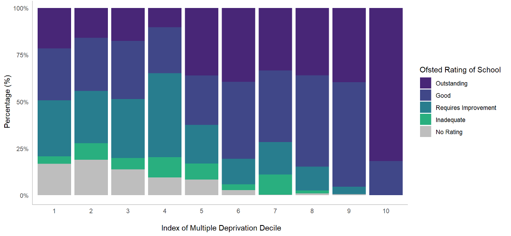

# Introduction

The provision of high-quality education is seen a powerful tool for improving social mobility. The use of education as a vehicle for improving social mobility relies on students from disadvantaged backgrounds obtaining access to education of the highest quality. In the situation where all schools provide the best possible education, this simply means ensuring children attend school. Unfortunately, there are large disparities in the quality of education offered by schools within a locality (as indexed by the large range of Ofsted ratings -- from 'Outstanding' through to 'Inadequate'). This raises questions about access to the highest performing schools as a function of socioeconomic position in the presence of such heterogeneity.

We explored this topic using Bradford as a case study. Bradford is a useful test case as the Local Authority serves some of the most deprived communities within the UK. In the Bradford District, 22% of children live below the poverty line and 13% of working age people have no qualifications (Bradford Council, 2019). It follows that access to a good education for Bradford's 90,000 school age pupils could have huge benefits on social mobility.

Nevertheless, it has been reported that just 44% of Bradford's children from disadvantaged backgrounds attend a school judged to be 'Good' or 'Outstanding' by Ofsted compared to 73% of children nationally (Bradford Opportunity Area, 2017, p.23). Moreover, 13% of children do not receive a place at one of their top three preference secondary schools compared to 7% across the whole of England (UK Government, 2019). This calls into question the effectiveness of the current school admission system for providing disadvantaged students access to the good schools they wish to attend. It may provide some explanation for the fact that the progress made at primary schools by students from disadvantaged backgrounds goes "into reverse at secondary as the school system lets pupils down" (Children's Commissioner, p.33).

This report focuses on the impacts of the school admissions system in the Bradford Local Authority, utilising data from the September 2019's secondary school student intake and the associated parental preferences. It reports on access to good schools as a function of socioeconomic position, the probability of a parental secondary school preference being granted, and inequalities of access within the region. The impact of various admissions criteria on the situation is explored.

# Where do students go to school?

In 2019, around 7,000 students were distributed across 33 secondary state schools in the Bradford District. The school attended by a child is the result of the school admissions process which offers places on the basis of parental preference and the selection criteria of the schools. This process is not always straightforward and is influenced by the popularity and performance of schools, the geography of the region and various social factors which influence parent's school choice. This results in a system where the flow of children from homes to schools is difficult to predict. The map below shows the Bradford Local Authority split up into Lower Super Output Areas (LSOAs). These are small geographic areas of near-equivalent population that are often used in research (see, ONS, 2016). On this map, the 'stars' show flows of students from the areas where children live to the school they attend. Each line represents a group of students, the darker and thicker the line, the more students within that group. Only groups of three or more are shown.

{#id .class width="100%" height="100%"}

It can be seen that some schools serve much larger areas than others with some students travelling long distances to school (shown by the larger 'stars'). These schools tend to be in the more rural areas of Bradford. In the more urban areas, schools have a more spatially constrained intake with students predominantly travelling smaller distances to school (show by smaller 'stars'). It can be seen that school flows overlap, with some students passing their closest schools to attend ones further away. This is especially the case in the centre of Bradford where the greatest crossover occurs - creating a dense web of flows.

When considering the impact of school admissions, we must also consider the context in which they occur. Bradford Local Authority faces many challenges in education together with problems in social care, physical health, mental health and social mobility. The Index of Multiple Deprivation (IMD) provides a broad indication of the social and economic characteristics of an area. The IMD measures the construct of 'deprivation', taking into account different factors such as income, health, crime, education and environment. IMD is often segmented into deciles (bands comprising 10% of the population).

The map below shows the Index of Multiple Deprivation deciles for Bradford's LSOAs. An IMD of one (shown in red) indicates that an area is within the 10% band of most deprived areas in England, an IMD of ten (shown in green) indicates it is within the 10% band of least deprived areas in England.

{.class width="100%" height="100%"}

It can be seen that around a third of Bradford's LSOAs are within the most deprived deciles in England. This demonstrates the high levels of poverty within the region (with the commensurate educational and social challenges). Nevertheless, it can also be seen that there are wealthy areas with an IMD of 10 in the Bradford Local Authority (predominantly in the North). This pattern indicates the inequalities that exist within the Bradford District.

# How do children get a school place?

The school admissions process follows clear guidelines as schools must select students in line with the School Admissions Code (2014) to ensure that places are "allocated and offered in an open and fair way". This is true for all state schools whether they are local authority run or academies, however, there is significant scope under this code for schools to set their own admission criteria. Despite these guidelines the admissions process is often misunderstood by parents and inequalities in outcomes mean that the 'fairness' of the admissions system can be called into question (Brooks & Tough, 2007, Coldron, 2015, Allen & West, 2011).

### The Process

-   In Bradford families are asked to choose up to five preferred schools. Families don't have to use all five preferences but the advice is to make five choices. • Schools rank all students that have applied to the school based on their 'oversubscription criteria'.

-   The 'oversubscription criteria' are a set of clearly stated rules which indicate which students should be prioritised e.g. those closest to the school, those with siblings at the school, or those of a particular faith. Applicants are matched with the top preference school which makes an offer to the applicant

-   Any child who does not get an offer from any of their preferred schools is offered a place at the physically closest school with available places.

### The claim:

Officials within the schools admission team caution against the perception that the system can be 'gamed' (for example by applying to just one school, or applying to the first choice school but selecting four schools that are extremely unlikely to provide an offer). This will not benefit applicants, and officials emphasise that every application to a school is considered separately so taking these actions increases your chances of receiving no offers (School Admissions Team 2020, p.8).

# What choices are parents making?

Parents must balance their decisions on school preference on; (i) the kind of school they wish their child to attend; (ii) the performance of different schools; (iii) their child's ability to commute to the school; (iii) the likelihood their child will be offered a place.

Plot 1 shows the number of applicants considered for every place available at each school. This measurement discounts students who received an offer from a school they put as a higher preference when applying (as their application to a lower preferences school becomes irrelevant). The green dashed line shows the level at which the number of applicants considered for a school place matches the number of available places. If there are fewer applications than the green line then the school is undersubscribed and the remaining places will be filled by students who have not received an offer at any of their preferred schools.

The popularity of Bradford schools differs widely. Some schools do not receive enough applications to fill their places, while others receive many more than they can give offers to. This contributes to a system where it is impossible to satisfy the preferences of all of the families. For example, it can be seen that at Dixons Trinity Academy (the most popular school in Bradford) six applicants are rejected for every applicant offered a place

{.class width="100%" height="100%"}

# Number of preferences chosen

One important question is whether families are using all their available preferences? Plot 2 shows the number of school preferences used by families. The highest single category comprises families that used their five preference choices. The majority of applicants, however, do not use all their preferences, with some only selecting a single school. This may have different implications in different areas depending on the amount of certainty an applicant has they will receive an offer. In areas where applicants live close to a distance-prioritising school, solely selecting this school would be low risk (though against the advice). The selection of only one 'fair banding school', where acceptance is not based on distance is high risk. Likewise, selection of a distance-prioritising school when living on the border of its intake zone, would be high risk.

{#id .class width="100%" height="100%"}

Figure 4: Number of preference options used by families applying to secondary school in Bradford, 2019

A comparison of the number of families who used different numbers of their preference choices with those families that did not receive an offer shows that students from all groups are vulnerable to an unfavourable outcome. Consequently, the school choices and the contexts in which they are made seems to be a major contributing factor to students not getting offers from their preferred schools. However, in many cases this outcome could have been avoidable if families had used all their preferences. The school admissions team strongly advise that all applicants apply to five schools and be realistic about their chances of receiving an offer from these schools, recommending that families put their closest school as one of their preferences but many parents clearly do not heed this advice.

{#id .class width="100%" height="100%"}

Figure 5: How related to missing out on any preference school is the number of choices families make?

# Inequalities in access to education?

The use of education as a tool to improve social mobility requires children from deprived backgrounds to have access to good schools. This raises the question of access to 'good' schools as a function of socioeconomic position. An analysis was therefore undertaken of access to good schools from areas with different levels of deprivation. For this analysis, all children in the Bradford Local Authority, including those who attended schools outside of the Authority, were included. In Bradford, a significant proportion of the student population attend school outside the Local Authority meaning it is important to include these students if we are to paint a full picture of educational access across the District. Thus, in addition to the 33 Bradford Schools, data for 18 schools from the surrounding area were also considered.\*

-   \*All students that attended Bradford schools but live in an area outside the Local Authority bounds are excluded. As the data from Bradford and non-Bradford schools comes from different sources (pre and post the appeal process for school placements) there are 63 students that are 'allocated' to more than one school. These students are excluded for consistency within the dataset and time period. Overall this makes up less than 1% of the database leaving 7782 students from Bradford within the analysis.

## Ofsted 

School performance is measured by Ofsted ratings which are awarded following inspections of the management and teaching quality at a school. Plot 4 shows the percentage of students attending schools within the different Ofsted categories as a function of the Index of Multiple Deprivation (IMD) of the child's home residence area. The colour of each bar indicates the proportion of children that attend a school of 'Outstanding', 'Good', 'Requires Improvement', 'Inadequate' or 'Unrated' Ofsted Rating.

We can see from this plot that children from all levels of deprivation background are attending schools rated 'Outstanding' and 'Good' by Ofsted. However, some students are attending schools that are rated as 'Requires Improvement' or 'Inadequate' indicating that the education they are receiving at the school falls below government expected standards in some way. The number of children attending schools with lower Ofsted ratings occurs in higher frequencies in areas with high deprivation compared to areas with the lowest deprivation.

{#id .class width="100%" height="100%"}

Figure 6: Ofsted Rating of school by Index of Multiple Deprivation of child's home residence Source: Bradford School Admissions Team, school admissions and preference data for the September 2019 intake, English IMD 2019, School Performance Data 2018.

It is worth noting that a proportion of the schools do not have an Ofsted rating - these tend to be schools which have recently opened or reopened as academies. In recent years, underperforming schools have been taken over and transformed into academies with the aim of improving standards (though this is not always the case). It is important to consider this when making year-by-year comparisons of areas as reopening a failing school as an academy leaves it without an Ofsted Rating until inspection, and hence can artificially inflate the proportion of students that appear to attend 'Good' or 'Outstanding' schools.

An analysis was undertaken to test the relationship between attending a 'Good' or better school and IMD (see textbox for more information). Plot 5 shows the likelihood that a child will attend a school rated 'Good' or better by Ofsted based on the Index of Multiple Deprivation (IMD) of the child's home residence.

In Bradford, the model predicts that the likelihood of attending a school rated 'Good' or better by Ofsted is close to 100% if the child lives in an area with an IMD of 10 (the 10% of areas that are least deprived), but decreases to 58% if a child lives in an area with an IMD of 1 (the 10% of areas that are most deprived).

The data suggest that there is very little difference in access to 'Good' schools between those areas with higher than average deprivation (IMD 1 -5) but the probability of access to a good schools rises steeply between IMD 6 and 10. In short, students from areas with lower levels of deprivation have a higher probability of attending a good school.

{#id .class width="100%" height="100%"}

Figure 7: Likelihood of a child attending a 'Good' or better school by the within-IMD decile of their home residence Source: Bradford School Admissions Team, school admissions and preference data for the September 2019 intake, English IMD 2019, School Performance Data 2018.

## Progress 8 

School performance can also be measured through 'Progress 8 Score'. A schools' Progress 8 score is an average measure of the progress a child makes between KeyStage2 and KeyStage4, compared to children of equivalent prior attainment nationally. A score of +1 means that pupils achieve one grade higher in their qualifications on average than other similar pupils, and a score of -1 indicates they achieve one grade below on average. In2018, the Progress 8 scores of secondary schools in Bradford ranged from -0.9 to 1.55.

Plot 6 is a violin plot showing the distribution of Progress 8 Score of the school a child attends plotted as a function of the IMD of the child's home residence. The pattern observed with the Ofsted rating appears to be repeated with a positive relationship found between the Progress 8 score of a child's school and the IMD of their home residence.

{#id .class width="100%" height="100%"}

Figure 8: Violin plot of the Index of Multiple Deprivation of child's home LSOA and the Progress 8 Score of the school they attend Source: Bradford School Admissions Team, school admissions and preference data for the September 2019 intake, English IMD 2019, School Performance Data 2018.

A linear regression was used to test this relationship. The results indicated that there is a significant association between Progress 8 and IMD (p\<0.001) though the magnitude of this inequality was small. The results indicate that the Progress 8 score of the school is 0.02 higher in value for each IMD decile increase in a child's home residence.

The most striking aspect of these results is the variation in inequality. In the more deprived areas there is a greater spread of scores, but less deprived areas are associated with a greater probability that students are attending schools with greater or equal to average Progress 8 scores. This variance of variance (or 'heteroscedasticity') is confirmed by a Breusch-Pagan test (p\<0.001)

# Inequalities of certainty? 

Trends for Bradford Year-on-year students in Bradford consistently receive offers from their top preference school at much lower frequencies than the regional and national average (see Plot 7a). In 2019, students across England were offered a place at their top preference school in 81% of cases but in Bradford this was just 72%. The same is true for receiving an offer from one of their top three preference schools (see Plot 7b). In 2019, students across England were offered a place at one of their top three preference schools in 93% of cases but in Bradford this value was only 87%. Additionally, students from Bradford do not receive an offer from any of their preferred schools in higher frequencies than the regional and national average and this trend has been increasing in recent years. In 2012 this occurred in just 2% of cases, but in 2019 this rose to 7%. This is despite Bradford offering students up to five preferences while many Local Authorities only offer three.

Overall this may be interpreted as a warning sign for problems with the admissions system or school choices in Bradford. It is important to ask why parental preferences in Bradford are not being fulfilled in such high numbers compared to other areas.

{#id .class width="100%" height="100%"}

{#id .class width="100%" height="100%"}

{#id .class width="100%" height="100%"}

Figures 9: Percentage of students nationally, regionally and in Bradford receiving an offer from (a) their top preference school; (b) one of their top three preference schools; (c) none of their preference schools. Source: Government statistics on applications and offers for secondary school, multiple years.

## Inequality within Bradford 

The fact that lower numbers of students are getting into their preferred schools in Bradford is likely to be an educational barrier for disadvantaged students. Nonetheless, this does not convey the full extent of the issue as inequalities are also apparent within Bradford when receiving offers from preference schools. Index of Multiple Deprivation (IMD) scores can also be used to compare LSOAs within Bradford. In the following analysis, students were broken up into groups, each containing 10% of the LSOAs in Bradford and ranked by their deprivation level according to the Index of Multiple Deprivation. Children from more deprived areas in Bradford have a lower chance of getting into their first preference school, a lower chance of getting into one of their top 3 preference schools and a higher chance of not receiving an offer from any of their preference schools at all. This is displayed in the graphs below.

{#id .class width="100%" height="100%"}

Figures 10a-c: Number of children receiving offers from (a) their top preference school; (b) one of their top three preference schools; (c) none of their preference schools, by IMD Source: Bradford School Admissions Team, school admissions and preference data for the September 2019 intake, English IMD 2019

In real terms, this means that within one of the 10% most deprived areas in Bradford, 66.6% of children are predicted to get into their top preference school compared to 83.8% within the 10% least deprived areas of Bradford. Similarly, 83.3% of these children are predicted to get one of their top three choices compared to 96.2% in the least deprived areas, and they are predicted to receive no offers from any of their preference schools in 8.6% of cases compared to just 1.8% for the most advantaged students.

These results indicate real inequality within admissions outcomes in Bradford, with students from more advantaged backgrounds obtaining their 'choices', while students from more disadvantaged backgrounds have greater uncertainty and a higher probability of disappointment when applying to schools.

## Mapping who gets their preferred school 

The maps below illustrate what the inequalities in school admissions means for different areas in Bradford. In the city-centre, there are significantly higher rates of children not receiving offers from their preferred schools, while in the more rural and richer areas children have a higher probability of receiving offers from their preferred schools. In some areas of Bradford, 100% of children received an offer from their first preference school in 2019, while 35% of students in other areas did not receive an offer from any of their preferred schools. This demonstrates that in some areas, and particularly the richer areas of Bradford, getting into a good school is a near-certainty, while in other areas getting a place at a good school has become a probabilistic exercise (i.e. a 'lottery'). The 'winners' will receive an offer at a school with one of the highest Progress 8 scores in Bradford while the 'losers' will fail to be offered a place in any of their preferred schools. The maps below show the rates at which students receive an offer at: (i) their first preference school; (ii) one of their top three preference schools; (iii) no preferred school, broken up by LSOA.

{#id .class width="100%" height="100%"}

Figure 11: Percentage of students receiving an offer at the secondary school they chose as their first preference, Bradford 2019.

{#id .class width="100%" height="100%"}

Figure 12: Percentage of students receiving an offer at one of the secondary schools they put as their top three preferences, Bradford 2019.

{#id .class width="100%" height="100%"}

Figure 13: Percentage of students not receiving an offer from any of the secondary schools they put as their preferences, Bradford 2019

There may be multiple and interacting reasons for this disparity:

First, most schools select pupils based on distance, therefore a 'selection by mortgage' effect can occur in more affluent areas allowing wealthy parents to gain access to good schools for their children by buying a house in the catchment area (with house prices having a commensurate premium).

Second, the city centre of Bradford has many areas of high deprivation. It is more densely populated than other areas of the District and has more schools in closer proximity to each other. This can lead to greater competition for school places, as more students are physically able to access these schools through public transport or by walking. Competition for school places is especially high as some schools perform significantly better than others.

There is also a cluster of very popular schools that use 'fair banding' in the city centre which are located in areas of high deprivation. This means that living close to one of these schools does not give preferential access (cf. 'selection by mortgage'). However, this arrangement may introduce greater uncertainty for parents applying to these schools (given the role of chance within the selection process). For more information of fair banding see 'Impacts of School Selection Criteria' in this report.

# School selection criteria

The selection criteria that schools choose to employ impacts student access to different schools and can broadly be broken up into four groups:

-   schools that select by distance or catchment zone

-   schools that select by religion

-   schools that select by "fair banding"

-   schools that are undersubscribed and therefore accept all applicants

The selection processes for these criteria are generally straightforward; schools that prioritise by distance will select students who live closer (sometimes through designated 'catchment zones'). Those that select by religion generally reserve a certain number of spaces (e.g. 20%) for those of a particular faith, whether that is a Church of England, Catholic or Muslim school. In these schools, parents are required to supply a Supplementary Information Form (SIF) about their religious background. Many of these schools prioritise other places based on distance.

The least straight forward selection criteria is "fair banding". For these schools, all children are required to sit a test and are then categorised into ability bands based on the results of the test. A proportion of children from each ability band are given places at the school according to further selection criteria. However, for equivalent candidates, the offer is randomised. This testing process is meant to act as a 'check' to make sure the intake of the school has an ability distribution matching that of the applicants to that school. This process means children of similar ability from any area have an equivalent chance of being accepted to the school. Undersubscribed schools must accept all applicants and students who have not applied to these schools may be placed at them. In Bradford there are no Grammar schools that select based on ability, although some Bradford students attend these schools in surrounding districts.

All schools, regardless of selection criteria, must adhere to The School Admissions Code (2014). The purpose of this code is to ensure school places are "allocated and offered in an open and fair way" (School Admissions Code, 2014, p.7). The code specifies that all children who are currently or have previously been 'looked after' must be accepted, and applicants with special educational, health or social needs where a school is specified in their EHCP (Education, Health and Care Plan) are prioritised.

Other popular selection criteria employed by school include giving priority to those who already have siblings attending the school (used by most schools), prioritising staff-children, or taking students from designated feeder primary schools/through-schools. Some specialist schools may also reserve places based on ability/aptitude (e.g. music or dance).

# School intake zones and certainty

The below map shows schools surrounded by areas of differing size. The size of the circle shows the minimum distance-to-school at which a child was rejected from the school, based on the 2019 student intake\*.

Exact distances may change each year, but for schools that select based on distance these circles indicate the boundaries of areas in which students are guaranteed to receive an offer from the school if they apply there (dependent on gender at single sex schools). The same can be said for religious schools unless the applicant applies based on faith. All schools that are undersubscribed have no circles surrounding them as no applicant is rejected, regardless of distance. We can see that for the schools using fair-banding their minimum distance is very small as this selection process does not prioritise those living close by the school and therefore even applicants who live very close have a similar chance of being rejected.

It should be noted that children who lived further away than this distance were admitted to each school. There are different reasons for this in the case of each school and applicant; it may be because the school's selection criteria is not based on distance (e.g. fair banding or religion) or because the child had special circumstances - whether this is on the grounds of a sibling attending the school, residence in a special 'priority' area or because of special educational, health or social needs. Two related patterns emerge from this map. Firstly, many of the areas of greater certainty where students lie within the intake-zone of a distance-prioritising school tend to also be the least deprived areas in Bradford. It is possible that there is a 'selection-by-mortgage' effect happening here in which a premium is added to houses near good distance-prioritising schools. This means that lower income families are priced out of both the area and school.

Secondly, there are significant gaps created between the overlapping circles on the map, these tend to be more deprived areas in Bradford. These indicate areas where students are not guaranteed entry to any Bradford school other than undersubscribed one which must accept all applicants. If parents and students in these areas do not fulfil special criteria to be accepted to a school (e.g. religion, special education circumstances or already having a sibling attending the school) their options remain to apply to 'fair banding' schools. Their acceptance or rejection from these schools is to some degree up to chance as in Bradford all these schools are oversubscribed. \*Applicants who were late applying are excluded.

{#id .class width="100%" height="100%"}

Figure 14: Map showing schools and the smallest distance away from the school at which a child's application was rejected, coloured by their selection criteria, 2019.

Comparison of this map to the earlier preference satisfaction maps (see 'Mapping who gets their preference school'), the areas in which gaps are shown between school-intake zones also areas which are more prone to children not receiving any offers from their preference schools, or receiving their top preferences in lower frequencies.

This is likely due to the unequal amounts of uncertainty children in these areas face when applying for schools compared to those in the catchment areas of distance-prioritising schools.

Two actions would 'fill' these gaps and give greater certainty for children applying to schools in these areas. First, if standards at undersubscribed schools were improved then the popularity of these schools would likely increase. Students living close to these schools would therefore be more likely to select them as a preference school. Second, schools that currently use 'fair banding' in these areas could consider selecting by distance or incorporating some form of distance-prioritising mechanism into their selection system. This would give students close to these schools greater certainty that they would gain a place.

# Impact of school selection criteria

## Distance to school

For every school in Bradford some students will travel only short distances to attend school every day, while others will travel longer. The selection criteria used by schools affect which children receive a place and consequently the distances children travel to school. In some cases, the differences may be subtle but collectively they can have far-reaching effects for school access and transportation around the city. The average distances to school travelled by students to schools vary by selection criteria. Children on average\* travel the smallest distance of 0.83 miles to attend schools that use religious selection and the largest distance of 1.02 miles\* to attend schools that select by 'fair banding'. However, this does not tell the whole story, the below violin plot shows the distribution of students' travelling distances to school by schools' selection criteria. Within these plots the wider 'bar' at any given distance, the more frequently students travel this distance to school.

-   \*median distance travelled to school in miles categorised by all students travelling to school using this selection criteria.

{#id .class width="100%" height="100%"}

Figure 15: Violin plot of distances travelled to school by school selection type

This plot tells us something interesting about the travel patterns to different types of schools. For those schools that prioritise applicants based on distance, as would be expected, the majority of students live very close to the school - travelling less than 1 mile. The same is true for both religious schools and those that are undersubscribed, however, these schools also have a small but notable proportion of their students travelling longer distances - as shown by the longer 'tails' of the graphs. In the case of religious schools, parents choose longer commutes to give their child access to faith based education. Contrastingly, the longer distances travelled by students at undersubscribed schools are due to students being placed there after receiving no offers from their preference schools. For schools that use 'fair banding' the distribution of students has a different pattern, with higher frequencies of students travelling slightly longer distances of around one mile to school.

These differences have the potential to have significant impacts on how children travel to school. The National Travel Survey reports that 80% of journeys under a mile are made by foot but after this point there is a steep decline, with less than 20% of people walking distances from 1 to 5 miles. These long journeys could then have impacts on traffic, pollution and carbon emissions within the Bradford District.

Comparing the distances students travel to school for schools using different selection criteria gives some insight into how these policies influence the patterns of movement to schools. However, measurements of distance-to-school are not directly comparable between groups as schools located across Bradford serve different communities. In more rural areas it is inevitable that students will travel longer distances to school as they will not have access to closer schools, while in more densely populated urban areas we would expect the distances travelled by students to be much smaller. Therefore, more sophisticated analysis and modelling methods that account for the distribution of schools across Bradford are needed to understand the effects of school selection criteria. For more information about Spatial Interaction Models see the box below.

## Exploring school admissions using Spatial Interaction Models

## SIM results

The results of the Spatial Interaction Models tell us several things about school admissions;

Despite other potential influencing factors such as school performance or specialisation distance-to-school has the largest impact of which schools children attend. School selection criteria impacts how distance influences school intakes; when accounting for whichreas schools serve those that prioritise by distance are expected to have the 'tightest' intakes, taking students mainly from their local area. Undersubscribed schools have slightly more dispersed intakes and then religious schools after that. Schools that use fair banding have the most dispersed intakes. SIMs can be used to predict school flows if all schools prioritised distance in their selection criteria. The results can be explored in the next section.

# Real and simulated school intakes

The maps below show the real and simulated intakes for four schools, each of these schools use a different selection criteria -- Distance, Religion, Fair Banding and an Undersubscribed school - and exemplify patterns typical of these groups. The real intakes show where students attending the school live, with the school shown as a grey dot on the map. Coloured LSOAs have at least one student from that area attending the school and darker blue LSOAs have the most students attending the school living in these areas -- see the key for a breakdown of numbers\*. Simulated results are estimates of what each schools' intake would look like if all schools selected students based on distances (produced by SIM 3). By comparing these pairs, we can inspect how the area a school serves is impacted by the way in which the school selects its students sensitive to the geographic location of the school, its size, and competition.

-   \*Natural Breaks(Jenks) are used to establish cut points based on the combined real and simulated intakes to retain consistency across both, however, breaks below 3 are not included to keep information undisclosed.

Comparing real and simulated intakes for schools shows us different patterns of change dependent on the selection criteria of the school. For schools that already select by distance their intake remains similar (as exemplified by Appleton Academy). There are some small differenced which can be explained by confounding factors not accounted for within the SIM - for example, if a student from further afield receives a place as they have a sibling already at the school. Overall the similar patterns validate the model and therefore allow us to estimate what intakes of schools would look like if all selected on distance.

At undersubscribed the real intakes express had 'hotspots' far away from the school where high numbers of students have not received an offer from any of their preference schools and are placed at the school as a result -- this can be seen in the case of Tong Leadership Academy. If all schools selected on distance it is likely that lower performing schools would remain undersubscribed, however, if these hotspots are caused by the uncertainty inherited from Fair Banding there may not be such high numbers of unplaced students.

St Bede's and St Joseph's Catholic School, a school that selects by religion, stands out as an example of a school whose simulated intake differs significantly from its real one. Like with undersubscribed schools some students are travelling long distance for their education, yet unlike at undersubscribed schools, students and parents have chosen to do so in order to receive specialist schooling. It should be noted, however, that not all religious schools show a similar intake pattern and other schools in Bradford, despite also selection by faith, have a much more localised intake.

Finally, for fair banding schools the real intakes generally expressed a patchwork pattern where student intakes surrounding the school were somewhat unpredictable -- as expressed by Dixons City Academy. The modelled intake is much smoother with high numbers of students taken from close to the school and a gentle fade-out.

# Impact on access to schools for different groups?

As shown by the previous maps the simulated intakes of schools predicted by SIM 3 show students to flow from different areas than real school intakes. This difference is more extreme for some schools than others. Given this, the demographic intake of a school could also be altered with higher or lower numbers of students from deprived areas being admitted. This can be tested by comparing differences in IMD decile of students between the real and simulated intakes.

Some have criticised certain types of selection criteria for contribution to unequal access to preference schools and high performing schools for different student groups. It has been argued that both selection by religion, and selection by fair banding have the potential to skew intakes by admitting more advantaged children, especially when employed by highly popular and high achieving schools. In the case of selection-by-religion, Allen & West (2011) find that not only are families with better educated parent and higher household income more likely to have religious affiliation but higher income religious families are also more likely to attend faith schools than lower-income religious families. This creates a system where middle class children are secured places at good schools based on their religious credentials.

In the case of fair banding, Tough and Brooks (2007) argue that a school's student intake can become unrepresentative of its local area if the applicants to that school are unrepresentative of that group, this is because admission to fair banding schools are not tied to distance (p.20). There is the potential for this to be true for Bradford's fair banding schools if students from more advantaged areas are applying as these schools are in deprived city-centre areas.

{#id .class width="100%" height="100%"}

Figure 17: Comparing IMD decile distribution of real and simulated school intakes for schools using different selection criteria.

Overall, at a school level, only very small differences in IMD are shown between real and simulated student intakes. There does not appear to be any large consistent or systematic pattern of variation in this based on the selection criteria of schools, although if we look at cumulative change by group, as is shown in Plots 10, some patterns do emerge. The most consistent pattern is that undersubscribed schools take many more students from deprived areas than expected given their location, and fewer from more advantaged areas. While more the product of an absence of selection criteria, this indicates that students from more advantaged areas are navigating the admissions process as to avoid these unpopular schools while students from the most deprived areas disproportionately are sent to them. This is likely also influenced by the fact disadvantaged students miss out on getting into preference schools in higher numbers than other groups and therefore are assigned undersubscribed schools. At the school level this means that less popular and lower achieving schools are also receiving higher numbers of the most disadvantaged students which could act as a barrier to improving standards.

The IMD differences between real and simulated intakes for distance-prioritising schools do not appear to be particularly systematic, however, some of the net losses of advantaged students from undersubscribed schools do appear to have transferred to distance-prioritising ones.

Selection by religion is indicated to exclude some of Bradford's most disadvantaged students, however, this does not occur evenly across all religious schools. St Bede's and St Joseph's Catholic school alone takes 52 fewer students from the most deprived areas (IMD 1). Allen & West (2011)'s conclusion that more advantaged children benefit from religious selection is support is this instance but not for all faith schools.

Finally, Fair Banding schools show the least variation, which is surprising given the 'patchwork' intake expressed on the previous map. There does appear to be a very small systematic difference here, with fewer students being taken from the most disadvantaged areas and more taken from middling levels of deprivation. However, as these numbers are very small this effect may not be robust over time or have substantial impact. Contrary to Tough and Brooks (2007) statements schools that use Fair Banding schools in Bradford do not appear to take an unexpected number of advantaged students given their location. This does highlight the need for more research however, as even small differences can have large systematic impacts over time.

Overall these graphs indicate that none of the selection criteria more than others automatically influence student intakes so that students from more advantaged areas are admitted to that school in higher numbers, at least within Bradford. There is, however, evidence that some schools' intakes are affected by their selection criteria.

It is also possible that schools' selection criteria may lead to schools taking intakes of more advantaged students in softer ways that are not highlighted by looking at the IMD of students' home areas. Tough and Brooks (2007, p.20) point out that selection by 'fair banding' can lead to intakes of students dissimilar to the local area of a school if applicants are unrepresentative of this group. This could mean that the overall ability levels of students at the school are inflated if higher ability students are applying from places in greater numbers than lower-ability students. A survey by Comprehensive Future points out that requiring children to sit a test outside of school hours may act as a deterrent for lower ability students or those whose parents, for whatever reason, do not bring them to be tested. Previous research has found that middle class parents undertake more research when applying to schools which may help them navigate the complexities of the admissions system better than those with disadvantaged backgrounds whose children may become further disadvantaged as a result.

# Not getting any preference

If a child does not receive an offer from any of their preference schools, they receive an offer from the closest school with available places at the end of the admissions process. In 2019, there were nine schools in Bradford Local Authority that were undersubscribed; Tong Leadership Academy, Dixons Cottingley Academy, Queensbury Academy, Hanson School, University Academy Keighley, Co-op Academy Grange, Laisterdyke Leadership Academy, Oasis Academy Lister Park and Bronte Girls' Academy.

For all of these schools, a significant proportion of their pupils are placed without choosing the school as one of their preferences. At Tong Leadership Academy this accounts for 59% of their 2019 intake. The consequences of this are under-researched but are likely to have negative impacts on both the students who attend these schools and the schools themselves.

{#id .class width="100%" height="100%"}

Figure 18: Bradford secondary schools and the preference attending children had rated school for 2019

The Bradford schools that do not fill their places all have underperforming Ofsted ratings; all but one (Oasis Lister Park) have an Ofsted rating below 'Good' or are uninspected new schools/academies. These schools tend to have low Progress 8 scores, which are on average 0.51 points lower than other Bradford schools.\*

The underperformance of these schools is unsurprising given their lack of popularity yet it evidences why students are likely to have negative perceptions about the schools and being placed there. Students may therefore start school unmotivated and feel disadvantaged compared to students who did get into their preference schools. At the school level, student attitude and reputation may act as a barrier for improving standards. Qualitative research with students, parents and teachers would be beneficial to understand the true impact of this situation.

Students who are placed at schools they did not put as one of their preferences travel on average 0.63 miles further to school than students who received an offer from one of their preferred schools\*. This acts as a further barrier for student attendance and motivation.

It is relevant to ask to what extent missing out on an offer from any preference school is a result of the school preferences made by families. If we look at the number of school preferences of those that did not receive an offer from any school made, the most frequent category is using all 5 choices, as is true with general applicants. This group is in fact even more pronounced amongst those that did not receive any school offers compared to those that did. This indicates that a major factor in whether a student receives no offers from preference schools regards the specific schools they choose rather than the number of preferences they make. It is strongly advised that families should use all their preference choices and many of these cases could have been avoidable if families had followed this advice.

-   \*median distance-to-school of children placed at a school because they didn't receive an offer from a preference school compared to median for all other children,
-   \*mean of undersubscribed schools compared to all other schools.

{#id .class width="100%" height="100%"}

Figure 19: How many school preference choices did families use in cases where did not receive an offer from any of their preference school?

# Conclusions

As is demonstrated in this report, rich and detailed insights about the school admissions system can be gained from analysis and modelling using the 2019 data for Bradford. However, this still creates a static snapshot showing one year of the admissions process. Although many of the patterns in student flows seem to be dictated by the geography and inequality of Bradford and the characteristics of schools, indicating we would expect similar outcomes each year, much more could be gained by expanding analysis over several years of data.

Using multiple years of data spatial-temporal models could be used to understand topics such as the impact changes in school selection criteria have had at a district level, the effect school performance has on popularity, how new schools opening or schools closing have impacted school access and how 'bulge' years might impact oversubscription at schools.

Alternatively, a comparative approach could be taken to see if schools' selection criteria have similar effects in other local authorities or whether the inequality of whose preferences are satisfied by the admissions process is unique to Bradford. Two approaches could be taken to do this; firstly, areas with a similar mix of school selection criteria (distance-prioritising, fair banding, religious and undersubscribed schools) but with different demographics than Bradford could be identified. For example, a wealthier local authority or one with less inequality between areas. This would allow us to understand the interactions between school selection criteria, deprivation and inequality. Secondly, areas with similar demographics and social issues to Bradford, but with different compositions of school selection criteria (e.g. those that do not have fair banding or religious schools, or that have selective schools). These comparisons would be useful for gaining a place-based understanding of how school selection criteria may have different consequences in different contexts. For example, in some London boroughs nearly all schools use fair banding selection policies and this is likely to have very different consequences to their more concentrated use in Bradford.

Within my current models the IMD of a child's home residence provides an estimate of that child's economic and social circumstances. However, there is also likely to be a good deal of variation within each LSOA. Individual level data about each child, for example their parents' income and highest education level, the child's ability level and educational attainment, their ethnicity and the family unit they live within would allow us to analyse the impact of these differences within the admissions system while accounting for the areas families live within.

This could also open up the possibility of using Agent Based Modelling (ABM) where an individuals' attributes inform rules about where they are likely to apply to school and the effects of this at a system level.

Overall, there is great importance and potential to continue to develop this project and strive for more equal access to education in Bradford and also across the UK should the scope of analysis be broadened.
